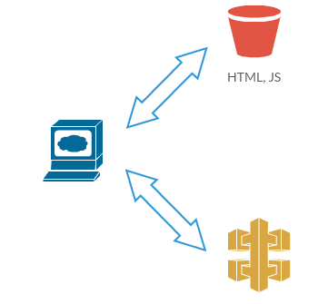

# LAB 1 - Creating IAM Role & S3 Bucket

## LAB Overview

#### This lab will demonstrate:
* Creating S3 buckets using CloudFormation
* Upload data to S3 Bucket
* Prepare code repository

## Task 1: Create S3 buckets

In this task you will create an S3 bucket to store data about your aplpications and second one to store your website.

1. Download **[CloudFormation template file](./cf_templates/s3.yaml)**.
2. In the AWS Management Console, on the **Services** menu, click **CloudFormation**.
3. Click **Create stack** and click  **With new resources**.
4. Choose **Upload a template file** and click **Choose file**.
5. Select the template file you downloaded in step 1.
6. Click **Next**.
7. Enter a name for your stack, e.g. "student-x-stack".
8. Enter a name for your private bucket.
9. Enter a name for your public bucket - this names needs to be different.
10. Click **Next**.
11. Click **Next**.
12. Click **Create**.
13. Look into **Outputs** of your stack. Save **WebsiteBucketName**, **AppsDefinitionBucketName** and **DomainName** for further use.

## Task 2: Copy applications definitions file to S3 bucket

In this task you'll upload a file to an S3 bucket.

1. Create or download  **[apps.json](apps.json)** file.
2. In the AWS Management Console, on the **Services** menu, click **S3**.
3. Find your private bucket (created in Task 1 step 8) and click on its name.
4. Click **Upload**.
5. Click *Add files**.
6. Select your "apps.json" file and click **Upload** in the left corner  .

## Task 3: Create a role for Lambda function

You will create a role for your Lambda. The role lets Lambda use other AWS services.

1. In the AWS Management Console, on the **Services** menu, click **IAM**.
2. Click **Roles**.
3. Click **Create role**.
4. Select **AWS Service** and **Lambda**.
5. Click **Next: Permissions**.
6. Find "AmazonS3ReadOnlyAccess" policy and add it to the role by checking the checkbox on the left.
7. Find "AmazonDynamoDBFullAccess" policy and add it to the role by checking the checkbox on the left.
8. Click button above **Create policy** (new windows will open).
9. Click **JSON**.
10. Download  **[Lambda_simple_policy.json](Lambda_simple_policy.json)** file.
11. Delete everything from the console editor and paste the file into editor field.
12. Click **Review policy**.
13. Enter a name for your policy, e.g. "SimpleLambdaPolicy".
14. Click **Create policy**.
15. Back in the role editor (previous tab) click  button, enter the name of your previously created policy into "Filter policies" search field.
16. Find you policy and add it to the role by checking the checkbox on the left.
8. Click **Next: Tags**.
9. Click **Next: Review**.
10. Enter a name for your role, e.g. "Lambda1-Role".
11. Click **Create role**.

Please, look into the role policies. 

## Task 4: Prepare a repository for the for the source code of frontend application.

In this task you will use code commit as repository for the application's code. You will also create a credentials to access to the repository.

1. In the AWS Management Console, on the **Services** menu, click **CodeCommit**.
2. Create a new repository by pressing **Create repository** button.
3. Fill the form:
   * Repository name: **studentX-repository**
   * Description: **Your Name**
4. Click **Create**.
5. Click **Clone URL** and select **Clone HTTPS**.
6. Save the URL to the notepad.
7. In the AWS Management Console, on the **Services** menu, click **IAM**.
8. Click **Users** and locate and select your user.
9. Switch to **Security credentials** tab.
10. Scrol down to **HTTPS Git credentials for AWS CodeCommit**.
11. Under that section click **Generate credentials**.
12. When new window appear copy and save username and password or use **Download credentials**.

## END LAB

  

