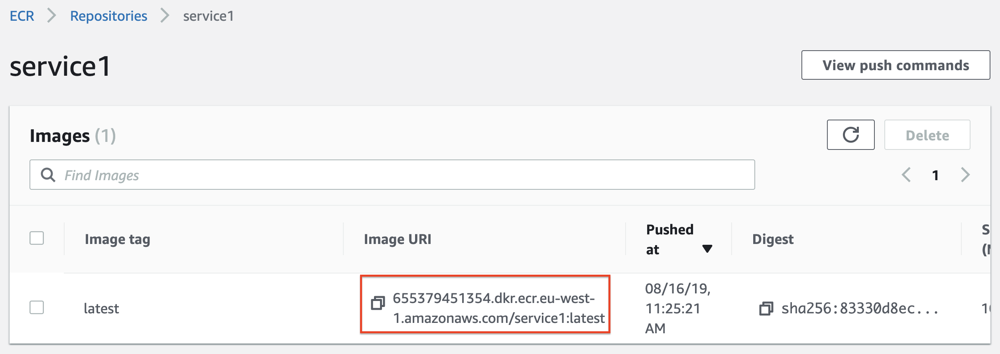
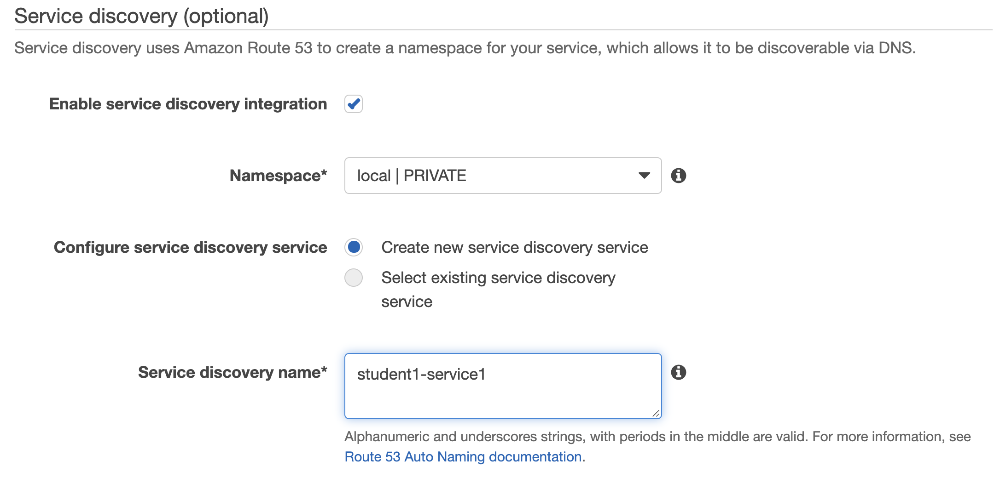
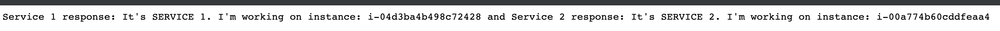

  
  
  

# Deploying to ECS

## LAB Overview

#### In this lab you will deploy the application to your ECS cluster.

## Task 1: Preparing security groups.
In this task you will prepare security groups for your load balancer and ECS instances.

1. In the AWS Management Console, on the **Services** menu, click **VPC**.
2. On the left pane click **Security groups**.
3. Click **Create security group**.
4. Set **Security group name** to *student-X-prod-alb-sg*.
5. Set **Description** to *Student X ALB security group*.
6. Select your VPC id. Ask leader for help if you can't find it.
7. Click **Create**.
8. Click **Close**.
9. Select the security group you've jus created.
10. Select **Inbound rules**.
11. Click **Edit rules**.
12. Click **Add rule**.
13. Set **Port range** to *80*.
14. Set **Source** to *0.0.0.0/0, ::/0*.
15. Click **Save rules**.
16. Click **Close**.
17. Click **Create security group**.
18. Set **Security group name** to *student-X-prod-ecs-sg*.
19. Set **Description** to *Student X ECS security group*.
20. Select your VPC id.
21. Click **Create**.
22. Click **Close**.
23. Select the security group you've jus created.
24. Select **Inbound rules**.
25. Click **Edit rules**.
26. Click **Add rule**.
27. Set **All TCP** as **Type**.
28. Set source to the security group you created for your Application Load Balancer (steps 3-16).
29. Click **Add rule**.
30. Set **All TCP** as **Type**.
31. Set source to the this security group.
32. Click **Save rules**.
33. Click **Close**.

## Task 2: Creating ECS cluster

In this task you will create ECS cluster for the application.

34. In the AWS Management Console, on the **Services** menu, click **ECS**.
35. Click **Create Cluster**.
36. Choose **EC2 Linux + Networking** option.
37. Click **Next step**.
38. Enter a name for your cluster, e.g. "student-X-prod-cluster".
39. Choose "On-demand instance".
40. Choose "t3.small" as your instance type.
41. Set number of instances to 2.
42. Scroll down to **Networking section**.
43. Select your VPC as **VPC**.
44. Add your public subnets.
45. Set your ECS security group as **Security group**.
46. Click **Create**.
47. Click **View cluster**.

## Task 3: Creating load balancer for your web-client service

48. In the AWS Management Console, on the **Services** menu, click **EC2**.
49. On the left panel click **Load balancers**.
50. Click **Create Load Balancer**.
51. Select **Application Load Balancers** and click **Create**.
52. Enter a name for your load balancer: *student-X-prod-ALB*.
53. Select the VPC you have ECS cluster in and add all subnets.
54. Click **Next: Configure Security Settings**.
55. Choose **Select an existing security group**.
56. Select the security group you created for your load balancer.
57. Click **Next: Configure Routing**.
58. Select *New target group* as **Target group**.
59. Enter a name for your target group, "student-X-prod-tg1".
60. Click **Next: Register Targets**.

Do not add any targets!!!.

61. Click **Next: Review**.
62. Click **Create**.
63. Click **Close**.

## Task 4. Preparing Task Definition for service 1

In this task you will prepare a task definition for one of microservices.

64. In the AWS Management Console, on the **Services** menu, click **ECS**.
65. On the left pane select **Task definitions**.
66. Click **Create new Task Definition**.
67. Select **EC2** and click **Next step**.
68. Enter a **Task Definition Name**, *student-X-service1-definition*.
69. Click **Add container**.
70. Enter a **Container name**, *student-1-service1-container*.
71. Set **Image** to the uri of your service 1 image. You can find in in the ECR repository.

72. Select **Hard Limit** for **Memory Limits** and set it to *128*.
73. Set **|Port mappings** as:
* **Host port**: 0,
* **Container port**: 80.
74. Scroll down and click checkmark the **Auto-configure CloudWatch Logs** option.
75. Scroll down and click **Add**.
76. Leave the rest unchanged, click **Create** and **View task definition**.

## Task 5. Preparing Task Definition for service 2

In this task you will prepare a task definition for one of microservices.

77. In the AWS Management Console, on the **Services** menu, click **ECS**.
78. On the left pane select **Task definitions**.
79. Click **Create new Task Definition**.
80. Select **EC2** and click **Next step**.
81. Enter a **Task Definition Name**, *student-X-service2-definition*.
82. Click **Add container**.
83. Enter a **Container name**, *student-1-service1-container*.
84. Set **Image** to the uri of your service 2 image. 
85. Select **Hard Limit** for **Memory Limits** and set it to *128*.
86. Set **|Port mappings** as:
* **Host port**: 0,
* **Container port**: 80.
87. Scroll down and click checkmark the **Auto-configure CloudWatch Logs** option.
88. Scroll down and click **Add**.
89. Leave the rest unchanged, click **Create** and **View task definition**.

## Task 6. Preparing Task Definition for web-client service.

In this task you will prepare a task definition for one of microservices.

90. In the AWS Management Console, on the **Services** menu, click **ECS**.
91. On the left pane select **Task definitions**.
92. Click **Create new Task Definition**.
93. Select **EC2** and click **Next step**.
94. Enter a **Task Definition Name**, *student-X-webservice-definition*.
95. Click **Add container**.
96. Enter a **Container name**, *student-1-webservice-container*.
97. Set **Image** to the uri of your service 2 image. 
98. Select **Hard Limit** for **Memory Limits** and set it to *128*.
99. Set **|Port mappings** as:
* **Host port**: 0,
* **Container port**: 80.
100. Scroll down to **Environment variables**.
101. Add two variables:
* **Key**: *service_1_endpoint*, **Value**: *studentX-service1.local*. Do not forget to replace X with your number. 
* **Key**: *service_2_endpoint*, **Value**: *studentX-service2.local*. Do not forget to replace X with your number. 
102. Scroll down and click checkmark the **Auto-configure CloudWatch Logs** option.
103. Scroll down and click **Add**.
104. Leave the rest unchanged, click **Create** and **View task definition**.

## Task 7: Creating services

In this task you will add two ECS services.

105. In the AWS Management Console, on the **Services** menu, click **ECS**.
106. Click **Clusters**.
107. Find your cluster and click on its name.
108. Select **Services**.
109. Click **Create**.
110. Set **Launch type** to *EC2*.
111. Set your service 1 task definition as **Task Definition**.
112. Select the latest revision.
113. Set **Service name** to *student-X-service1*.
114. Set **Service type** to *Replica*.
115. Set **Number of tasks** to 1.
116. Click **Next step**.
117. Set **Load balancer type** to **None**.
118. Scroll down to **Service discovery**.
119. Set **Namespace** as **create new namespace**.
120. Set **Namespace name** to *local*.
121. Select your VPC as **Cluster VPC**.
122. Set **Configure service discovery service** to **Create new service discovery service**.
123. Set **Service discovery name** to *studentX-service1*. Do not forget to replace X with your number.

124. Scroll down and click **Next step**.
125. Click **Next step**.
126. Click **Create service**.

Now you will create second service.

127. Select **Services**.
128. Click **Create**.
129. Set **Launch type** to *EC2*.
130. Set your service 2 task definition as **Task Definition**.
131. Select the latest revision.
132. Set **Service name** to *student-X-service2*.
133. Set **Service type** to *Replica*.
134. Set **Number of tasks** to 1.
135. Click **Next step**.
136. Set **Load balancer type** to **None**.
137. Scroll down to **Service discovery**.
139. Set **Namespace name** to *local*.
140. Select your VPC as **Cluster VPC**.
141. Set **Configure service discovery service** to **Create new service discovery service**.
142. Set **Service discovery name** to *studentX-service2*. Do not forget to replace X with your number.

143. Scroll down and click **Next step**.
144. Click **Next step**.
145. Click **Create service**.

## Task 8: Creating service for the main webservice

In this task you will add ECS service.

146. Select **Services**.
147. Click **Create**.
148. Set **Launch type** to *EC2*.
149. Set your web-client service task definition as **Task Definition**.
150. Select the latest revision.
151. Set **Service name** to *student-X-webservice*.
152. Set **Service type** to *Replica*.
153. Set **Number of tasks** to 1.
154. Click **Next step**.
155. Set **Load balancer type** to **Application Load Balancer**.
156. Select the load balancer you created in task 3 as **Load balancer name**.
157. Select your container and port as **Container name : port
** and click **Add to load balancer**.
158. Select **HTTP:80** as **Production listener port**.
159. Select **reate new** as **Target group name
** and set its name to *student-x-web-tg*.
160. Set **Path pattern** to */* * and set **Evaluation order** to *1*.
161. Set **Health check path** to */*.
162. Turn off **Service discovery** by unchecking **Enable service discovery integration** option.
163. Click **Next step**.
164. Select **Do not adjust the service’s desired count** and click **Next step**.
165. Click **Create service**.
166. Click **View service**.

## Task 9: Testing the solution

177. Open your load balancer window and copy its **DNS name**.
188. Open any browser and paste the url of your ALB.

You should get response similiar to the following:

If everything is ok, please remove all your services. Do not remove load balancer.

For services which use service discovery you will have to delete ECS instances. To do it:

189. Select your cluster.
190. Select **ECS Instances**.
191. Click **Scale ECS instances**.
192. Set **Desired number of instances** to *0*.

When your instances disappers, you can delete services. Please, delete also **service discovery service** by checking **Delete the service discovery service "student1-service2" created with this service.** 

## END LAB

  

&copy; 2019 Chmurowisko Sp. z o.o.

